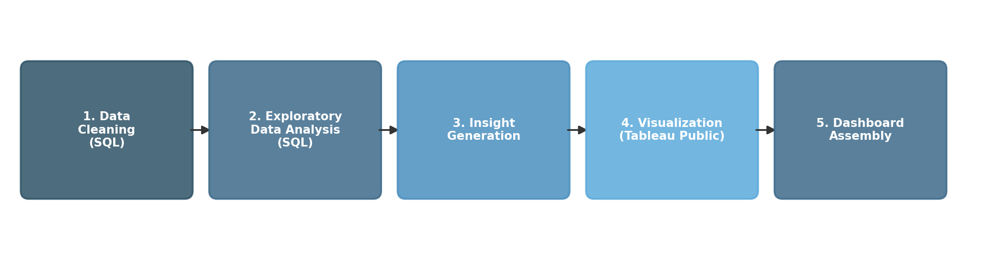

# HR Churn Risk Analysis
### End-to-End SQL and Tableau Project

  

---

## Table of Contents
0 [Executive Summary](#0-executive-summary)
1. [Introduction](#1-introduction)
   - [Project Background](#a-project-background)
   - [Dataset Overview](#b-dataset-overview)
2. [Analysis Objectives](#2-analysis-objectives)
3. [Tools, Framework and Process](#3-tools-framework-and-process)
4. [Dashboard](#4-dashboard)
5. [Insights and Action Recommendations](#5-insights-and-action-recommendations)

---

## Executive Summary

This company operates with a performance and reward system that consistently fails to recognize and retain its highest contributing employees. Combined with department-level burnout concentrated in Finance, structural disengagement in R&D and Human Resources, and a training program that actively demotivates rather than develops its participants, the organization faces compounding retention risks across multiple fronts.

The reward system is inversely aligned with performance at almost every level examined. Low performers receive higher salary hikes than top performers, long-serving employees stagnate at low job levels without meaningful recognition, and the most satisfied and balanced employees receive the lowest financial rewards despite contributing the most.

Most critically, only **4.64% of the entire workforce** simultaneously achieves genuine job satisfaction and healthy work-life balance. This should be treated as the company's most urgent retention target and the clearest measure of how far the organization needs to go to become a place where people genuinely choose to stay.

---

## Introduction

### Project Background

This project is an end-to-end data analysis of a simulated Human Resources dataset containing 1,000 employee records. Many companies struggle to understand *why* employees leave, and often rely on assumptions instead of data when designing retention strategies. This project was built to address that gap by turning raw HR data into clear, actionable insight.

The core problem this project tackles is simple: **the company does not know which factors are actually driving employee churn**, whether it is compensation, workload, career stagnation, or department-level culture issues.

The goal of this project is to identify the real drivers of churn risk using a structured, data-driven approach, and to translate those findings into practical recommendations that HR leadership can act on immediately.

The analysis was conducted entirely using **SQL** for data cleaning and exploration, and **Tableau Public** for visualization and dashboard development, following a structured EDA methodology from raw data validation through to business insight generation.

### Dataset Overview

The dataset contains **19 columns across 1,000 employee records** (991 records after cleaning, with 9 duplicates removed), covering five key areas:

| Category | Columns |
|---|---|
| **Demographics** | `employee_id`, `age`, `gender`, `marital_status`, `education_level` |
| **Department & Job Details** | `department`, `job_role`, `job_level` |
| **Tenure & Experience** | `years_at_company`, `years_in_role`, `num_companies_worked` |
| **Compensation & Benefits** | `monthly_salary`, `salary_hike_%`, `overtime` |
| **Wellbeing & Performance** | `work_life_balance`, `job_satisfaction`, `performance_rating`, `training_hours`, `distance_from_home` |

---

## Analysis Objectives

This analysis was designed to answer three core business questions for leadership:

**Objective 1 — Identify Churn Drivers**
Pinpoint which factors, such as low job satisfaction, specific departments, and salary misalignment, are most correlated with employees leaving the company.

**Objective 2 — Improve Retention Strategies**
Develop targeted interventions such as improved work-life balance programs, revised compensation structures, or enhanced training in departments with high turnover.

**Objective 3 — Enhance Employee Experience**
Gain insight into what truly motivates and retains employees, so the organization can build a more positive and productive work environment.

---

## Tools, Framework and Process
The project followed a structured five-phase framework from raw data to final dashboard:



1. **Data Cleaning (SQL)** — Null checks, duplicate detection, outlier checks, distribution analysis, and value validation across all 19 columns.
2. **Exploratory Data Analysis (SQL)** — Six analytical themes investigated, including performance distribution, salary hike alignment, tenure stagnation, overtime concentration, training impact, and satisfaction vs. work-life balance correlation.
3. **Insight Generation** — Findings translated into business insights using a "what, why, so-what" framework, resulting in seven ranked churn risk priorities.
4. **Visualization (Tableau Public)** — Eight interactive visualizations built to cover all seven churn risk priorities.
5. **Dashboard Assembly** — All visualizations combined into a single interactive dashboard with a department-level filter for drill-down analysis.

---

## Dashboard

**Dashboard Name:** HR Churn Risk Dashboard
**Access:** [View on Tableau Public](#) *(add link after publishing)*


**Key features:**
- Department filter updates all charts simultaneously for drill-down analysis
- Consistent color language — red signals risk, green signals health, orange signals overtime
- Tooltips on every chart provide additional context on hover
- KPI banner gives immediate company-wide context before any chart is read
- Interactive job level filter on the training chart for segmented analysis

---

## Insights and Action Recommendations

The analysis reveals a company where compensation, promotion, and recognition are largely disconnected from actual employee performance and wellbeing. Salary hikes are almost identical across every performance rating, with a gap of less than half a percent between the best and worst performers. Forty-six low performers received hikes above 20 percent while forty top performers received less than 5 percent, affecting 86 employees whose pay has no meaningful link to their contribution. This should be addressed immediately by tying salary hikes directly to performance rating bands and reviewing the overpaid low performers as a first step.
 
Beyond compensation, two departments show clear signs of structural disengagement. Research and Development and Human Resources both have far more low performers than top performers, together affecting 257 employees, while Legal achieves the strongest results in the company with a similar headcount, suggesting the difference comes down to management and culture rather than resources. Targeted engagement surveys in these two departments, benchmarked against Legal's practices, would help pinpoint whether the root cause is leadership, role clarity, or career growth.
 
Tenure tells a similar story of stagnation rather than growth. The 382 employees who have stayed with the company for thirteen years or more form the largest group in the workforce, yet they also show the lowest average performance and little to no salary progression, with many still stuck at the lowest job level despite their long service. Introducing a formal promotion review for anyone who has remained at the same level for more than five years, along with tenure-based recognition and lateral growth opportunities, would help re-engage this group before disengagement turns into departure.
 
Workload is another pressure point, most visibly in Finance, where 60 percent of employees work overtime, the highest rate in the company and a clear burnout risk for around 130 people. Operations offers a useful internal benchmark, sustaining a similarly high overtime rate while still maintaining strong work-life balance, which suggests the problem in Finance is one of workload management rather than an unavoidable feature of the department. Capping overtime and redistributing workload in Finance, while studying and adopting Operations' practices elsewhere, would directly reduce this risk.
 
At the individual level, the data also surfaces a distinct high-risk group of 63 employees who report both low job satisfaction and poor work-life balance at the same time, over half of whom are also working overtime. This combination makes them the single highest churn risk segment in the workforce and warrants immediate exit-risk interviews and individually tailored interventions such as workload adjustments, flexible arrangements, or compensation review. Training investment, meanwhile, shows almost no relationship to better performance across all 991 employees, and satisfaction actually declines the more training hours an employee accumulates, pointing to a program that feels obligatory rather than valuable. Replacing broad mandatory training with shorter, role-specific development capped at forty to sixty hours, and linking it to visible career progression, would likely do more for both performance and morale than the current approach.
 
Finally, only 46 employees, just 4.64 percent of the entire workforce, simultaneously report high satisfaction and strong work-life balance, and this small group ironically receives the lowest salary hike of any segment in the analysis despite being the most engaged. The company is currently benefiting from their goodwill without properly rewarding it, and that goodwill will not last indefinitely. An upward compensation review for this group, along with a deliberate effort to understand and replicate the conditions that allow them to thrive, would protect the organization's healthiest and most valuable employees while offering a model for what a better employee experience across the company could look like.

---

## Project Structure

```
HR-Churn-Risk-Analysis/
│
├── README.md
├── HR Churn Risk Dashboard.png      # Tableau dashboard preview
├── process-flow.png                 # Project workflow diagram
├── datacleaningsteps.sql            # SQL data cleaning and validation queries
├── hr_churn_dataset                 # Raw HR dataset (1,000 employee records)
└── hr_churn_cleaned.csv             # Cleaned dataset (991 records, post data cleaning)
```

---

## Author

**Project type:** End-to-End Data Analysis (SQL and Tableau)
**Dataset:** Simulated HR data — 1,000 employees, 19 columns
**Scope:** Data cleaning, EDA, insight generation, dashboard development

*This project was completed as part of an end-to-end data analyst portfolio exercise, covering the full workflow from raw data ingestion through to business insight delivery.*
